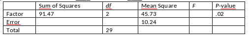

```{r, echo = FALSE, results = "hide"}
include_supplement("vufgb-onewayanova-012-nl-table01.jpg", recursive = TRUE)
```

Question
========

Given is the table below with results of a one-way ANOVA ("one-way ANOVA").

Complete.

The F-value is ... and the SSE is ... .


  
Answerlist
----------
* 4.47 ; 276.48
* 4.47 ; 266.24
* 0.22 ; 276.48
* 0.22 ; 266.24

Solution
========

Answerlist
----------
* Correct
* Incorrect
* Incorrect
* Incorrect

Meta-information
================
exname: vufgb-onewayanova-012-en
extype: schoice
exsolution: 1000
exsection: Inferential Statistics/Parametric Techniques/ANOVA/Oneway ANOVA, Inferential Statistics/Parametric Techniques/ANOVA/ANOVA F-test, Inferential Statistics/Regression/Sum of squares
exextra[ID]: 5443f
exextra[Type]: Interpreting output
exextra[Program]: 
exextra[Language]: English
exextra[Level]: Statistical Literacy
