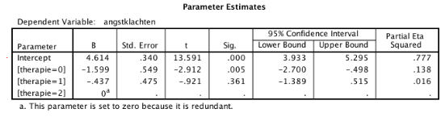

```{r, echo = FALSE, results = "hide"}
include_supplement("vufgb-onewayanova-013-nl-table01.jpg", recursive = TRUE)
```

Question
========

Given below are parameter estimates from a one-way ANOVA with a factor with three levels (0=Health therapy, 1=Group therapy, 2= Individual therapy).

Calculate the predicted mean for the Family Therapy group.


  
Answerlist
----------
* 4.16
* 4.18
* 3.02
* 2.58

Solution
========

Answerlist
----------
* Incorrect
* Incorrect
* Correct
* Incorrect

Meta-information
================
exname: vufgb-onewayanova-013-en
extype: schoice
exsolution: 0010
exsection: Inferential Statistics/Parametric Techniques/ANOVA/Oneway ANOVA, Descriptive statistics/Summary Statistics/Measures of Location/Mean
exextra[Type]: Calculation, Interpreting output
exextra[Program]: 
exextra[Language]: English
exextra[Level]: Statistical Literacy
