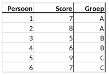

```{r, echo = FALSE, results = "hide"}
include_supplement("vufgb-onewayanova-305-en-table01.jpg", recursive = TRUE)
```

Question
========

Onderstaande tabel komt uit een onderzoek waarin personen (*Persoon*) willekeurig worden toegewezen aan groep (*Groep*) A, B of C. Bereken de gemiddelde kwadratische fout tussen groepen (*MS between*).


  
Answerlist
----------
* 1
* 2
* 3
* 3.5

Solution
========

Answerlist
----------
* Onjuist
* Onjuist
* Onjuist
* Juist

Meta-information
================
exname: vufgb-onewayanova-305-nl
extype: schoice
exsolution: 0001
exsection: Inferential Statistics/Parametric Techniques/ANOVA/Oneway ANOVA
exextra[ID]: a6b36
exextra[Type]: Calculation, Interpreting output
exextra[Program]: 
exextra[Language]: Dutch
exextra[Level]: Statistical Literacy
