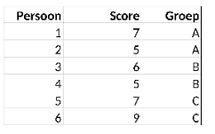

```{r, echo = FALSE, results = "hide"}
include_supplement("vufgb-onewayanova-308-en-table01.jpg", recursive = TRUE)
```

Question
========

Onderstaande tabel komt uit een onderzoek waarin personen (*Persoon*) willekeurig worden toegewezen aan groep (*Groep*) A, B of C. Bereken de gemiddelde kwadratische fout binnen groepen (*MS within*).


  
Answerlist
----------
* 1.5
* 2.3
* 3.5
* 4.5

Solution
========

Answerlist
----------
* Juist
* Onjuist
* Onjuist
* Onjuist

Meta-information
================
exname: vufgb-onewayanova-308-nl
extype: schoice
exsolution: 1000
exsection: Inferential Statistics/Parametric Techniques/ANOVA/Oneway ANOVA
exextra[ID]: 9e15b
exextra[Type]: Calculation
exextra[Program]: 
exextra[Language]: Dutch
exextra[Level]: Statistical Thinking
