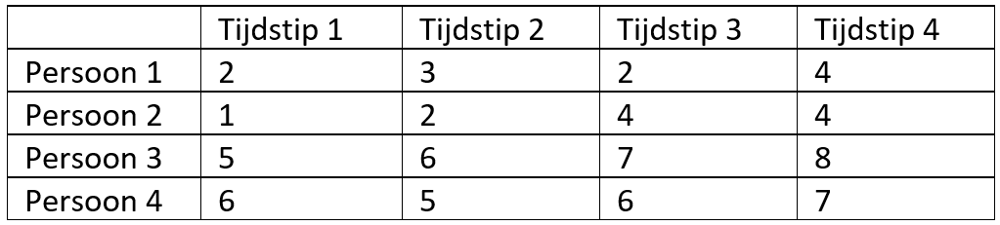

```{r, echo = FALSE, results = "hide"}
include_supplement("vufgb-onewayrepeatedmeasuresanova-003-nl.png", recursive = TRUE)
```

Question
========
Gegeven zijn de volgende scores van 4 personen op 4 herhaalde metingen. 



Bereken het persoonseffect voor persoon 2 ($π_2$).

Answerlist
----------
* -0.50.
* -1.50.
* -1.75.
* -3.00.

Meta-information
================
exname: vufgb-onewayrepeatedmeasuresanova-003-nl
extype: schoice
exsolution: 0010
exsection: Inferential Statistics/Parametric Techniques/ANOVA/Oneway repeated measures ANOVA
exextra[ID]: f31a7
exextra[Type]: Calculation
exextra[Language]: Dutch
exextra[Level]: Statistical Thinking
