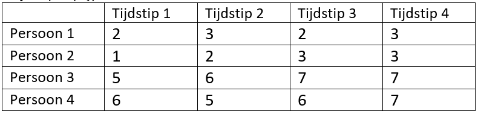

```{r, echo = FALSE, results = "hide"}
include_supplement("vufgb-onewayrepeatedmeasuresanova-005-nl.png", recursive = TRUE)
```

Question
========
Given are the following scores of 4 individuals on 4 repeated measures. 



Calculate the time effect for time 4 ($τ_4$).

Answerlist
----------
* 0.25.
* 0.75.
* 1.
* 1.75.

Meta-information
================
exname: vufgb-onewayrepeatedmeasuresanova-005-EN
extype: schoice
exsolution: 0100
exsection:Inferential Statistics/Parametric Techniques/ANOVA/Oneway repeated measures ANOVA
exextra[Type]: Calculation, Interpreting output
exextra[Language]: Dutch
exextra[Level]: Statistical Thinking
