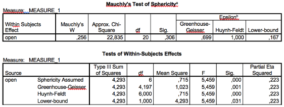

```{r, echo = FALSE, results = "hide"}
include_supplement("vufgb-onewayrepeatedmeasuresanova-021-nl-table01.jpg", recursive = TRUE)
```

Question
========

Given are the following results from a repeated measures ANOVA.

Which *F* test of within-subject effects should be reported?


  
Answerlist
----------
* Sphericity Assumed
* Greenhouse-Geisser
* Huynh-Feldt
* Lower-bound

Solution
========

Answerlist
----------
* Correct
* Incorrect
* Incorrect
* Incorrect

Meta-information
================
exname: vufgb-onewayrepeatedmeasuresanova-021-en
extype: schoice
exsolution: 1000
exsection: Inferential Statistics/Parametric Techniques/ANOVA/Oneway repeated measures ANOVA, Inferential Statistics/Parametric Techniques/ANOVA/ANOVA F-test
exextra[ID]: d267e
exextra[Type]: Conceptual, Interpreting output
exextra[Program]: SPSS
exextra[Language]: English
exextra[Level]: Statistical Literacy
