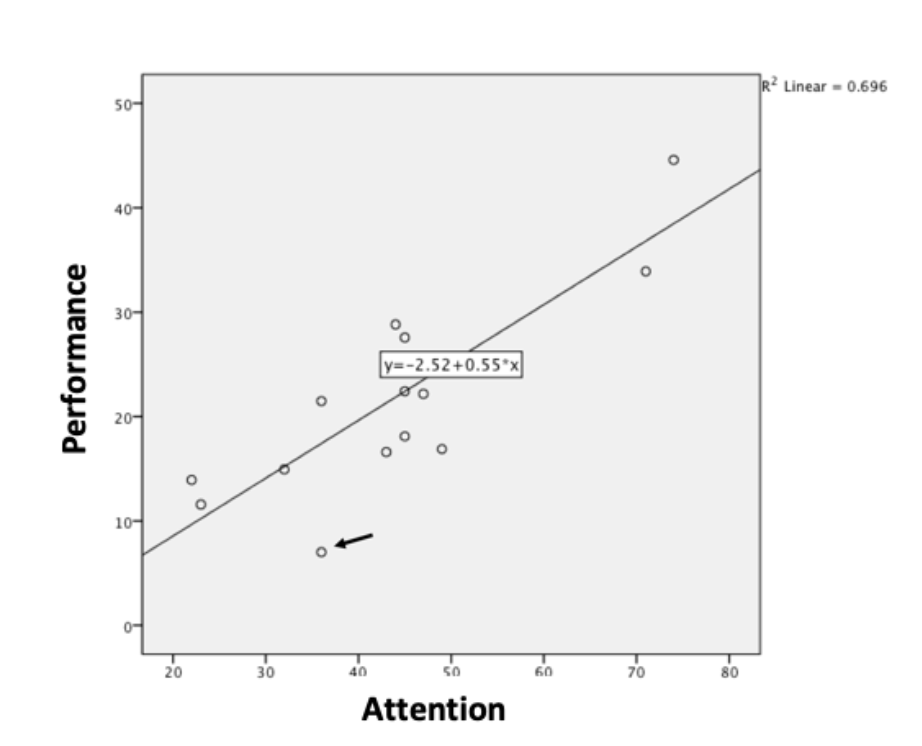

```{r, echo = FALSE, results = "hide"}
include_supplement("vufgb-pearson-001-en-graph-01.png", recursive = TRUE)
```
Question
========
  
The estimated regression coefficient *b* of the association between Attention and Performance is 0.55 (see Figure). The standard deviation of Attention is 14.30 and of Performance 9.49. Compute the correlation *r* between Attention and Performance.



Answerlist
----------
* 0.83.
* 0.91.
* 0.37.
* 0.60.

Solution
========

Answerlist
----------
* Correct 
* Incorrect 
* Incorrect 
* Incorrect

Meta-information
================
exname: vufgb-pearson-001-en
extype: schoice
exsolution: 1000
exsection: Inferential Statistics/Parametric Techniques/Correlations/Pearson
exextra[ID]: 6278e
exextra[Type]: Calculation
exextra[Language]: English
exextra[Level]: Statistical Thinking
