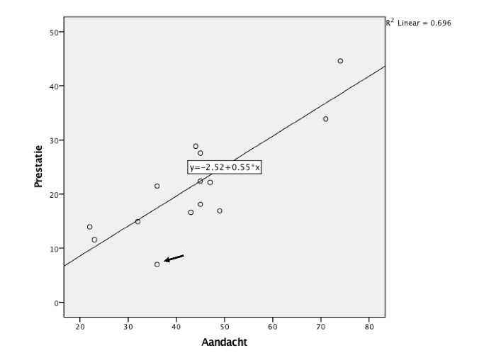

```{r, echo = FALSE, results = "hide"}
include_supplement("vufgb-pearson-001-nl-graph-01.png", recursive = TRUE)
```
Question
========
  
De geschatte regressiecoëfficiënt *b* van het verband tussen Aandacht en Prestatie blijkt 0.55 (zie figuur). De standaarddeviatie van Aandacht is 14.30 en van Prestatie 9.49. Bereken de correlatie *r* tussen Aandacht en Prestatie.




Answerlist
----------
* 0.83.
* 0.91.
* 0.37.
* 0.60.

Solution
========

Answerlist
----------
* Correct 
* Incorrect 
* Incorrect 
* Incorrect

Meta-information
================
exname: vufgb-pearson-001-nl
extype: schoice
exsolution: 1000
exsection: Inferential Statistics/Parametric Techniques/Correlations/Pearson, Inferential Statistics/Regression/R squared
exextra[Type]: Calculation
exextra[Language]: Dutch
exextra[Level]: Statistical Thinking
