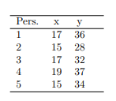

```{r, echo = FALSE, results = "hide"}
include_supplement("vufgb-pearson-004-nl-table01.jpg", recursive = TRUE)
```

Question
========
  
The following table of scores on a criterion (Y ) and a predictor (X) relates to the following two tasks.



The resulting regression equation is $\hat{y} = 8.5+1.5x$.

What is the correlation between the two variables? 
Answerlist
----------
* 0.42
* 0.90
* 0.96
* 0.70

Solution
========

Answerlist
----------
* Incorrect
* Incorrect
* Correct
* Incorrect

Meta-information
================
exname: vufgb-pearson-004-en
extype: schoice
exsolution: 0010
exsection: Inferential Statistics/Parametric Techniques/Correlations/Pearson, Descriptive statistics/Data representation/Tables, Inferential Statistics/Regression
exextra[Type]: Calculation
exextra[Program]: 
exextra[Language]: English
exextra[Level]: Statistical Thinking
