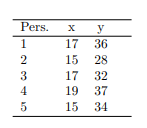

```{r, echo = FALSE, results = "hide"}
include_supplement("vufgb-pearson-004-nl-table01.jpg", recursive = TRUE)
```

Question
========
  
De volgende tabel met scores op een criterium (Y ) en een voorspeller (X) heeft betrekking op de volgende twee opgaven.



De resulterende regressievergelijking is $\hat{y} = 8.5+1.5x$.

Hoe groot is de correlatie tussen beide variabelen?
  
Answerlist
----------
* 0.42
* 0.90
* 0.96
* 0.70

Solution
========

Answerlist
----------
* Incorrect
* Incorrect
* Correct
* Incorrect

Meta-information
================
exname: vufgb-pearson-004-nl
extype: schoice
exsolution: 0010
exsection: Inferential Statistics/Parametric Techniques/Correlations/Pearson, Descriptive statistics/Data representation/Tables, Inferential Statistics/Regression
exextra[Type]: Calculation
exextra[Program]: 
exextra[Language]: Dutch
exextra[Level]: Statistical Thinking