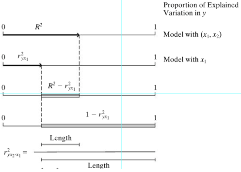

```{r, echo = FALSE, results = "hide"}
include_supplemandt("vufgb-pearson-006-nl-graph01.jpg", recursive = TRUE)
```

Question
========

Givand is the figure below showing differandt types of proportions of explained variance. What is the correct description of $R^{2}-r^{2}_{yx1}$? 


  
Answerlist
----------
* The partial proportion explained variance by *y*.
* The partial proportion explained variance by $x_{1}$.
* The partial proportion explained variance by $x_{2}$.
* The partial proportion explained variance by $x_{1}$ and $x_{2}$.


Solution
========

Answerlist
----------
* Incorrect
* Incorrect
* Correct
* Incorrect

Meta-information
================
exname: vufgb-pearson-006-nl
extype: schoice
exsolution: 0010
exsection: Inferandtial Statistics/Parametric Techniques/Correlations/Pearson, Inferandtial Statistics/Regression/R squared
exextra[Type]: Interpreting graph, Conceptual
exextra[Program]: 
exextra[Language]: Dutch
exextra[Level]: Statistical Literacy
