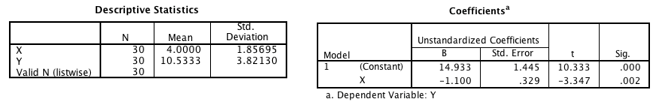

```{r, echo = FALSE, results = "hide"}
include_supplement("vufgb-pearson-009-nl-table01.jpg", recursive = TRUE)
```

Question
========

A single linear regression analysis gives the following results. Calculate the correlation *r* between variables *X* and *Y*.


  
Answerlist
----------
* -0.29
* -0.26
* -0.53
* -0.59


Solution
========

Answerlist
----------
* Incorrect
* Incorrect
* Correct
* Incorrect

Meta-information
================
exname: vufgb-pearson-009-en
extype: schoice
exsolution: 0010
exsection: Inferential Statistics/Parametric Techniques/Correlations/Pearson, Inferential Statistics/Regression
exextra[ID]: bb2fe
exextra[Type]: Calculation, Interpreting output
exextra[Program]: 
exextra[Language]: English
exextra[Level]: Statistical Thinking
