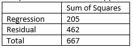

```{r, echo = FALSE, results = "hide"}
include_supplement("vufgb-pearson-011-nl-table01.jpg", recursive = TRUE)
```

Question
========

A researcher performs a single linear regression to examine the relationship between self-control (*x*) and physical activity (*y*). Given is the Table of Squares ("Sums of Squares") below. Calculate the correlation (*r*) between *x* and *y*.


  
Answerlist
----------
* 0.09
* 0.31
* 0.55
* 0.69

Solution
========

Answerlist
----------
* Incorrect
* Incorrect
* Correct
* Incorrect

Meta-information
================
exname: vufgb-pearson-011-en
extype: schoice
exsolution: 0010
exsection: Inferential Statistics/Parametric Techniques/Correlations/Pearson, Inferential Statistics/Regression/R squared
exextra[Type]: Calculation
exextra[Program]: 
exextra[Language]: English
exextra[Level]: Statistical Literacy
