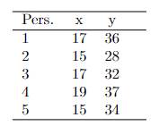

```{r, echo = FALSE, results = "hide"}
include_supplement("vufgb-prediction-001-nl-table01.jpg", recursive = TRUE)
```

Question
========
Zie onderstaande tabel met scores op een criterium (Y ) en een voorspeller (X). 

De resulterende regressievergelijking is $\hat{y} = 8.5+1.5x$.

Voor welke proefpersoon (Pers.) ligt de voorspelling het dichtst bij de waargenomen score?


  
Answerlist
----------
* Proefpersoon 1.
* Proefpersoon 2.
* Proefpersoon 3.
* Proefpersoon 4.

Solution
========

Answerlist
----------
* Correct
* Incorrect
* Incorrect
* Incorrect

Meta-information
================
exname: vufgb-prediction-001-nl
extype: schoice
exsolution: 1000
exsection: Inferential Statistics/Regression/Prediction, Descriptive statistics/Data representation/Tables
exextra[Type]: Interpreting output
exextra[Program]: 
exextra[Language]: Dutch
exextra[Level]: Statistical Literacy
