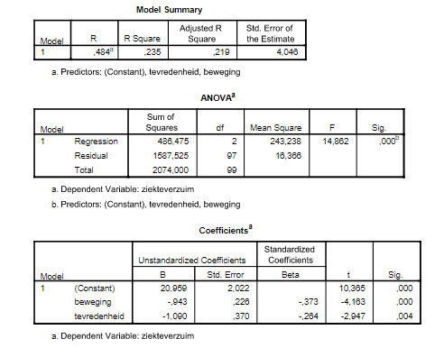

```{r, echo = FALSE, results = "hide"}
include_supplement("vufgb-prediction-002-nl-table01.jpg", recursive = TRUE)
```

Question
========

Een arbeidspsycholoog onderzoekt het verband tussen ziekteverzuim (aantal uren per jaar), lichamelijke beweging (variabele ‘beweging’ = aantal uren sporten per maand) en tevredenheid met de werksituatie (variabele ‘tevredenheid’ = Likert variabele met vijf categorieën van 1 (zeer ontevreden) tot 5 (zeer tevreden)). Een multiple regressie van ziekteverzuim op de andere twee variabelen leidt tot de volgende uitkomst.


  
Wat is volgens dit model het voorspelde aantal uren ziekteverzuim per jaar van een werknemer die 4 uur per maand sport en die zeer tevreden is met de werksituatie?  
  
Answerlist
----------
* 11.74 uur
* 18.92 uur
* 20.96 uur
* 30.18 uur

Solution
========

Answerlist
----------
* Correct
* Incorrect
* Incorrect
* Incorrect

Meta-information
================
exname: vufgb-prediction-002-nl
extype: schoice
exsolution: 1000
exsection: Inferential Statistics/Regression/Prediction, Descriptive statistics/Data representation/Tables
exextra[Type]: Calculation, Interpreting output
exextra[Program]: 
exextra[Language]: Dutch
exextra[Level]: Statistical Thinking