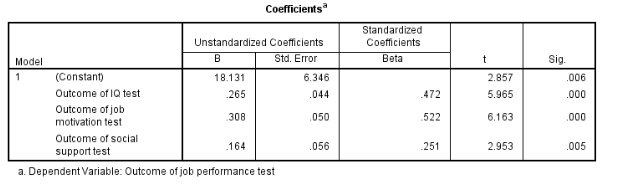

```{r, echo = FALSE, results = "hide"}
include_supplement("vufgb-prediction-004-nl-table01.jpg", recursive = TRUE)
```

Question
========

A psychologist examines the predictive value of intelligence (*IQ test*), job motivation (*job motivation test*) and social support (*social support test*) on job productivity (*job performance test*). According to the estimated regression model below, what is the predicted job productivity for someone with an IQ of 105, motivation of 60 and measured social support of 70?


  
Answerlist
----------
* 75.916
* 57.785
* 64.436
* 116.581 

Solution
========

Answerlist
----------
* Correct
* Incorrect
* Incorrect
* Incorrect

Meta-information
================
exname: vufgb-prediction-004-en
extype: schoice
exsolution: 1000
exsection: Inferential Statistics/Regression/Prediction
exextra[Type]: Interpreting output, Calculation
exextra[Program]: 
exextra[Language]: English
exextra[Level]: Statistical Literacy
