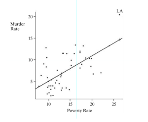

```{r, echo = FALSE, results = "hide"}
include_supplement("vufgb-prediction-006-nl-scatterplot01.jpg", recursive = TRUE)
```

Question
========

Given below is the point cloud ("scatterplot") with regression line showing the relationship between poverty and homicide in different states in the United States.

Determine the predicted *y* score ($\hat{y}$) for the state of Lousiana (LA).


  
Answerlist
----------
* 5.7
* 14.6
* 20.3
* 26.3

Solution
========

Answerlist
----------
* Incorrect
* Correct
* Incorrect
* Incorrect

Meta-information
================
exname: vufgb-prediction-006-en
extype: schoice
exsolution: 0100
exsection: Inferential Statistics/Regression/Prediction, Descriptive statistics/Data representation/Graphs/Scatterplot, Inferential Statistics/Regression
exextra[ID]: c9332
exextra[Type]: Interpreting graph
exextra[Program]: 
exextra[Language]: English
exextra[Level]: Statistical Literacy
