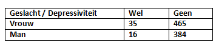

```{r, echo = FALSE, results = "hide"}
include_supplement("vufgb-proportion-001-nl-table01.jpg", recursive = TRUE)
```

Question
========
  
(Chronic) depression occurs at different rates in men and women. Using the cross tabulation below, calculate the relative risk for depression to reflect this correlation.


  
Formula for relative risk:

$rr = \frac{\pi_{1}}{\pi_{2}}$

Answerlist
----------
* 1.21
* 1.75
* 1.81
* 2.19


Solution
========

Answerlist
----------
* Incorrect
* Correct
* Incorrect
* Incorrect

Meta-information
================
exname: vufgb-proportion-001-en
extype: schoice
exsolution: 0100
exsection: Descriptive statistics/Summary Statistics/Proportion, Descriptive statistics/Data representation/Tables
exextra[ID]: b4985
exextra[Type]: Calculation
exextra[Program]: 
exextra[Language]: English
exextra[Level]: Statistical Literacy
