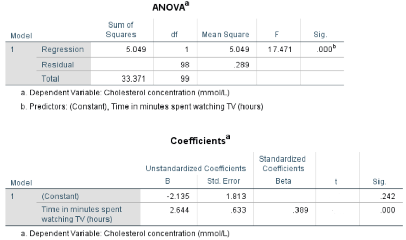

```{r, echo = FALSE, results = "hide"}
include_supplement("vufgb-regression-001-en.png", recursive = TRUE)
```

Question
========
A regression analysis was performed on survey results for 100 participants. It is apparent that there is a statistically significant positive association between the number of hours per day someone watches television and their cholesterol concentration. Part of the regression output is provided below, with some information missing.



Fill in the blanks: 

i. The total variance in cholesterol concentration that remains unexplained is ... .
ii. The *t*-statistic for the regression coefficient, indicating the association between the two variables, is ... .

Answerlist
----------
* i: 15.1%, ii: 0.615
* i: 84.9%, ii: 0.615
* i: 15.1%, ii: 4.177
* i: 84.9%, ii: 4.177

Meta-information
================
exname: vufgb-regression-001-en
extype: schoice
exsolution: 0001
exsection: Inferential Statistics/Regression, Inferential Statistics/NHST/Test statistic/t-statistic
exextra[Type]: Calculation, Case, Interpreting output
exextra[Language]: English
exextra[Level]: Statistical Thinking