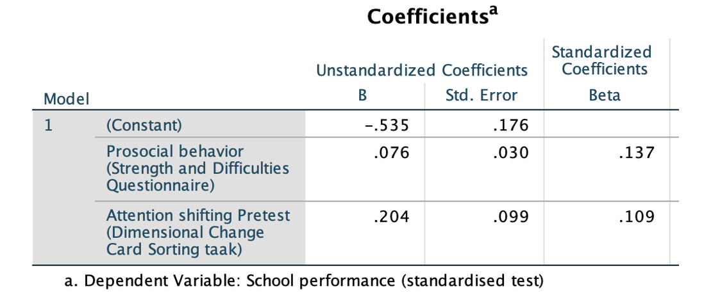

```{r, echo = FALSE, results = "hide"}
include_supplement("vufgb-regression-004-en-graph-01.png", recursive = TRUE)
```
Question
========
  
View the SPSS results below. A multiple regression was conducted on the effects of prosocial behavior and the ability to switch attention on the school performance of 350 students. School performance was measured using a standardized CITO test with a mean score of 0 and a standard deviation of 1. 

 

What is the 95% confidence interval for the regression coefficient (b) of attention shifting and what does that mean?
  
Answerlist
----------
* [0.01; 0.40]; this means the association between attention shifting and school performance significantly depends on prosocial behavior.
* [0.01; 0.40]; this means that attention shifting is significantly associated with school performance, controlled for prosocial behavior.
* [0.00; 0.41]; this means the association between attention shifting and school performance **does not** significantly depend on prosocial behavior.
* [0.00; 0.41]; this means that attention shifting is **not** significantly associated with school performance, controlled for prosocial behavior.

Solution
========

Answerlist
----------
* Incorrect
* Correct
* Incorrect
* Incorrect

Meta-information
================
exname: vufgb-regression-004-en
extype: schoice
exsolution: 0100
exsection: Inferential Statistics/Regression, Inferential Statistics/Regression/Confidence interval
exextra[ID]: 73563
exextra[Type]: Calculation, Case
exextra[Language]: English
exextra[Level]: Statistical Thinking
