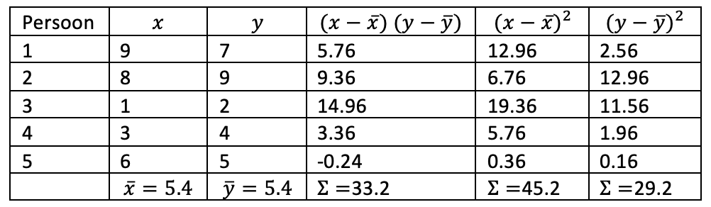

```{r, echo = FALSE, results = "hide"}
include_supplement("vufgb-regression-013-nl-graph-01.png", recursive = TRUE)
```
Question
========
  
The table shows the scores on x and y for a sample of 5 people. Calculate the regression coefficient *b* and the intercept *a*. Calculate with two decimal places.

 
  
Answerlist
----------
* *b*=0.65 ; *a*=1.89.
* *b*=0.65 ; *a*=8.91.
* *b*=0.73 ; *a*=1.46.
* *b*=0.73 ; *a*=9.34.

Solution
========

Answerlist
----------
* Incorrect
* Incorrect
* Correct
* Incorrect

Meta-information
================
exname: vufgb-regression-013-en
extype: schoice
exsolution: 0010
exsection: Inferential Statistics/Regression
exextra[Type]: Calculation
exextra[Language]: English
exextra[Level]: Statistical Thinking
