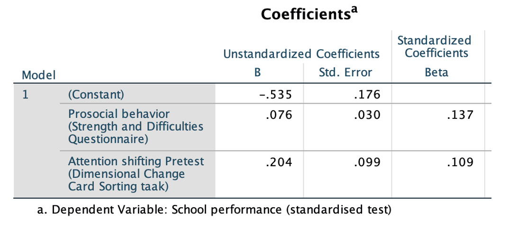

```{r, echo = FALSE, results = "hide"}
include_supplement("vufgb-regression-017-nl-graph-01.png", recursive = TRUE)
```
Question
========
  
Review the SPSS results below. A multiple regression was conducted on the effects of prosocial behavior and the ability to switch attention on the school performance of 350 students. School performance was measured using a standardized CITO test with a mean score of 0 and a standard deviation of 1. 

 

What is the 95% confidence interval for the regression coefficient (b) of attention switching and what does it mean? 
Answerlist
----------
* [0.01; 0.40]; this means that the relationship between attention switching and school performance depends significantly on prosocial behavior.
* [0.01; 0.40]; this means that attention switching is significantly related to school performance, controlled for prosocial behavior.
* [0.00; 0.41]; this means that the relationship between attention switching and school performance **not** significantly depends on prosocial behavior.
* [0.00; 0.41]; this means that attention switching is **not** significantly related to school performance, controlled for prosocial behavior.

Solution
========

Answerlist
----------
* Incorrect
* Correct
* Incorrect
* Incorrect

Meta-information
================
exname: vufgb-regression-017-en
extype: schoice
exsolution: 0100
exsection: Inferential Statistics/Regression, Inferential Statistics/Regression/Confidence interval
exextra[Type]: Calculation, Case
exextra[Language]: English
exextra[Level]: Statistical Thinking
