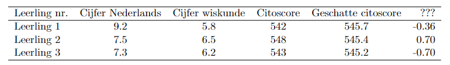

```{r, echo = FALSE, results = "hide"}
include_supplement("vufgb-regression-018-nl-table01.jpg", recursive = TRUE)
```

Question
========

The principal of a gymnasium tries to estimate from students in the first grade, on the basis of report grades on Dutch and mathematics, what their citoscore was last year. To do this, he estimates the following equation.

$E(Citoscore) = \alpha+\beta_{1}CijfNed+\beta_{2}CijfWis$

The results of the first three students are as follows.


  
Regarding the last column, the director says, "If we run the regression on the data of all students except student 1, the estimated score of student 1 becomes 0.36 points higher compared to the estimated score based on the data of all students.  

What statistic is in the last column? 
Answerlist
----------
* PRESS
* Leverage
* DFFIT
* DFBETA

Solution
========

Answerlist
----------
* Incorrect
* Incorrect
* Correct
* Incorrect

Meta-information
================
exname: vufgb-regression-018-en
extype: schoice
exsolution: 0010
exsection: Inferential Statistics/Regression
exextra[ID]: 1e94b
exextra[Type]: Interpreting output
exextra[Program]: 
exextra[Language]: English
exextra[Level]: Statistical Thinking
