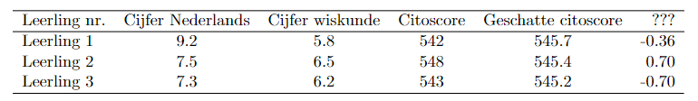

```{r, echo = FALSE, results = "hide"}
include_supplement("vufgb-regression-018-nl-table01.jpg", recursive = TRUE)
```

Question
========

De directeur van een gymnasium probeert om van leerlingen in de eerste klas op basis van rapportcijfers op Nederlands en wiskunde te schatten wat vorig jaar hun citoscore is geweest. Hiervoor schat hij de volgende vergelijking.

$E(Citoscore) = \alpha+\beta_{1}CijfNed+\beta_{2}CijfWis$

De resultaten van de eerste drie leerlingen zijn als volgt.


  
Met betrekking tot de laatste kolom zegt de directeur: ‘Als we de regressie uitvoeren op de gegevens van alle leerlingen behalve leerling 1, dan wordt de geschatte score van leerling 1 0.36 punten hoger in vergelijking met de geschatte score op basis van de gegevens van alle leerlingen’.  

Welke statistiek staat er in de laatste kolom?
  
Answerlist
----------
* PRESS
* Leverage
* DFFIT
* DFBETA

Solution
========

Answerlist
----------
* Incorrect
* Incorrect
* Correct
* Incorrect

Meta-information
================
exname: vufgb-regression-018-nl
extype: schoice
exsolution: 0010
exsection: Inferential Statistics/Regression
exextra[Type]: Interpreting output
exextra[Program]: 
exextra[Language]: Dutch
exextra[Level]: Statistical Thinking