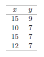

```{r, echo = FALSE, results = "hide"}
include_supplement("vufgb-residuals-005-nl-table01.jpg", recursive = TRUE)
```

Question
========

See details below:


  
The estimate of the standard deviation of the residuals is 1.028. What is the mean square error (MSE)?  
  
Answerlist
----------
* 1.03
* 2.11
* 1.06
* 2.05

Solution
========

Answerlist
----------
* Incorrect
* Incorrect
* Correct
* Incorrect

Meta-information
================
exname: vufgb-residuals-005-en
extype: schoice
exsolution: 0010
exsection: Inferential Statistics/Regression/Residuals
exextra[ID]: 72279
exextra[Type]: Calculation, Interpreting output
exextra[Program]: 
exextra[Language]: English
exextra[Level]: Statistical Literacy
