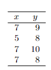

```{r, echo = FALSE, results = "hide"}
include_supplement("vufgb-residuals-008-nl-table01.jpg", recursive = TRUE)
```

Question
========
Given are the following data.

The estimate of the squared sum (SS) of the residuals is 2.0. Now determine the standard error of the residuals.


  
Answerlist
----------
* 2.00
* 0.50
* 1.00
* 0.67

Solution
========

Answerlist
----------
* Incorrect
* Incorrect
* Correct
* Incorrect

Meta-information
================
exname: vufgb-residuals-008-en
extype: schoice
exsolution: 0010
exsection: Inferential Statistics/Regression/Residuals
exextra[ID]: 3d617
exextra[Type]: Calculation, Interpreting output
exextra[Program]: 
exextra[Language]: English
exextra[Level]: Statistical Literacy
