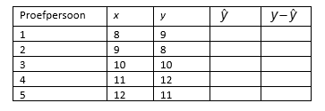

```{r, echo = FALSE, results = "hide"}
include_supplement("vufgb-residuals-010-nl-table01.jpg", recursive = TRUE)
```

Question
========

The scores on *x* and *y* of five subjects are shown in the table below. The estimated regression line is $\hat{y} = 2+0.8x$. For which subject did the residue $y-\hat{y}$ the smallest absolute value?


  
Answerlist
----------
* Subject 1
* Subject 2
* Subject 3
* Test subject 5

Solution
========

Answerlist
----------
* Incorrect
* Incorrect
* Correct
* Incorrect

Meta-information
================
exname: vufgb-residuals-010-en
extype: schoice
exsolution: 0010
exsection: Inferential Statistics/Regression/Residuals, Inferential Statistics/Regression/Equation
exextra[Type]: Interpreting output
exextra[Program]: 
exextra[Language]: English
exextra[Level]: Statistical Literacy
