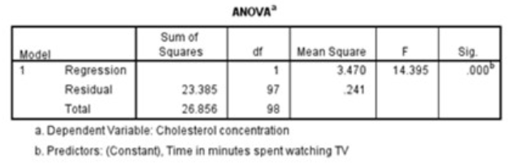

```{r, echo = FALSE, results = "hide"}
include_supplement("vufgb-rsquared-001-nl-table01.jpg", recursive = TRUE)
```

Question
========

Uit een regressieanalyse op basis van 99 personen blijkt dat het aantal minuten dat iemand per dag
televisie kijkt statistisch significant positief samenhangt met de concentratie cholesterol in het bloed.
Een deel van de output zie je hieronder.

Hoeveel procent van de totale variantie in cholesterolwaarden is verklaard in dit model?



Answerlist
----------
* 35.9%
* 64.1%
* 12.9%
* 87.1%

Solution
========

Answerlist
----------
* Incorrect
* Incorrect
* Correct
* Incorrect

Meta-information
================
exname: vufgb-rsquared-001-nl
extype: schoice
exsolution: 0010
exsection: Inferential Statistics/Regression/R squared
exextra[Type]: Interpreting output
exextra[Program]: 
exextra[Language]: Dutch
exextra[Level]: Statistical Thinking