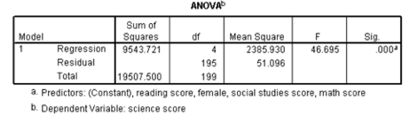

```{r, echo = FALSE, results = "hide"}
include_supplement("vufgb-rsquared-003-en-table01.jpg", recursive = TRUE)
```

Question
========
  
From the regression analysis performed on survey results for 200 participants it 
is apparent that there is a statistically significant positive association between 
a students' science score and their reading score. Part of the regression output 
is provided below. What percentage of the total variance in reading score remains 
unexplained in this model? 
  


Answerlist
----------
* 51.1%
* 48.9% 
* 195.8%
* 4.2%


Solution
========
  
Answerlist
----------
* Correct
* Incorrect
* Incorrect
* Incorrect

Meta-information
================
exname: vufgb-rsquared-003-en
extype: schoice
exsolution: 1000
exsection: Inferential Statistics/Regression/R squared
exextra[Type]: Calculation
exextra[Program]: 
exextra[Language]: English
exextra[Level]: Statistical Thinking