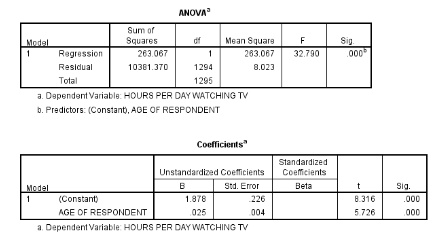

```{r, echo = FALSE, results = "hide"}
include_supplement("vufgb-rsquared-003-nl-table01.jpg", recursive = TRUE)
```

Question
========
  
Uit een regressieanalyse op basis van een **survey** onder 1296 personen blijkt dat leeftijd statistisch significant positief samenhangt met het aantal uur dat iemand per dag televisie kijkt. Een deel van de output zie je hieronder. Hoeveel procent van de totale variantie in het aantal uren dat iemand per dag televisie kijkt blijft onverklaard in dit model?



  
Answerlist
----------
* 2.5% 
* 5.0 %
* 95.0%
* 97.5%


Solution
========

Answerlist
----------
* Incorrect
* Incorrect
* Incorrect
* Correct

Meta-information
================
exname: vufgb-rsquared-003-nl
extype: schoice
exsolution: 0001
exsection: Inferential Statistics/Regression/R squared
exextra[ID]: 03cc9
exextra[Type]: Calculation
exextra[Program]: 
exextra[Language]: Dutch
exextra[Level]: Statistical Thinking
