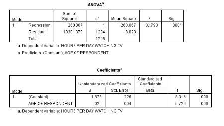

```{r, echo = FALSE, results = "hide"}
include_supplement("vufgb-rsquared-004-en-table01.jpg", recursive = TRUE)
```

Question
========
  
From the regression analysis performed on survey results for 1296 participants it is apparent that there is a statistically significant positive association between a person’s age and the number of hours per day someone watches television. Part of the regression output is provided below. What percentage of the total variance in *hours per day watching* **tv**  remains unexplained in this model? 


  
Answerlist
----------
* 2.5% 
* 5.0 %
* 95.0%
* 97.5%


Solution
========

Answerlist
----------
* Incorrect
* Incorrect
* Incorrect
* Correct

Meta-information
================
exname: vufgb-rsquared-004-en
extype: schoice
exsolution: 0001
exsection: Inferential Statistics/Regression/R squared
exextra[Type]: Calculation
exextra[Program]: 
exextra[Language]: English
exextra[Level]: Statistical Thinking
