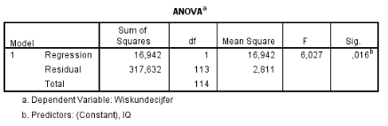

```{r, echo = FALSE, results = "hide"}
include_supplement("vufgb-rsquared-006-nl-table01.jpg", recursive = TRUE)
```

Question
========
  
Een regressieanalyse naar de samenhang tussen IQ en behaalde wiskundecijfers op het eindexamen is uitgevoerd op basis van informatie over 115 eerstejaarsstudenten. Een deel van de output is hieronder weergegeven. Bereken op basis hiervan de R-kwadraat (*R-Square*).


  
Answerlist
----------
* 0.051
* 0.053
* 0.225
* 0.231


Solution
========

Answerlist
----------
* Correct
* Incorrect
* Incorrect
* Incorrect

Meta-information
================
exname: vufgb-rsquared-006-nl
extype: schoice
exsolution: 1000
exsection: Inferential Statistics/Regression/R squared, Descriptive statistics/Data representation/Tables
exextra[Type]: Calculation, Interpreting graph
exextra[Program]: 
exextra[Language]: Dutch
exextra[Level]: Statistical Thinking
