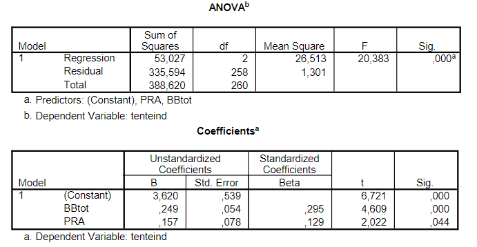

```{r, echo = FALSE, results = "hide"}
include_supplement("vufgb-rsquared-008-nl-table01.jpg", recursive = TRUE)
```

Question
========
  
In de analyse die werd
uitgevoerd op de data van 348 studenten werden drie variabelen gebruikt: cijfer op blackboardtoetsen
(BBtot), cijfer op het practicum (PRA) en cijfer op het tentamen (tenteind). Er werd van tevoren
aangenomen dat alle cijfers een positieve relatie met elkaar hebben.

Hoe groot is de proportie verklaarde variantie van dit regressie-model?


  
Answerlist
----------
* 0.267
* 0.154
* 0.136
* 0.369

Solution
========

Answerlist
----------
* Incorrect
* Correct
* Incorrect
* Incorrect

Meta-information
================
exname: vufgb-rsquared-008-nl
extype: schoice
exsolution: 0100
exsection: Inferential Statistics/Regression/R squared, Inferential Statistics/Regression/R squared
exextra[Type]: Calculation, Interpreting output
exextra[Program]: 
exextra[Language]: Dutch
exextra[Level]: Statistical Thinking