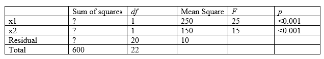

```{r, echo = FALSE, results = "hide"}
include_supplement("vufgb-rsquared-010-en-table01.jpg", recursive = TRUE)
```

Question
========

A multiple regression analysis is executed in SPSS.

Underneath you will find the incomplete ANOVA table. 

Calculate the *R*-squared ($R^{2}$) of the model.


  
Answerlist
----------
* 0.33
* 0.50
* 0.60
* 0.67

Solution
========

The formula for the $R^{2}$ is $\frac{(TSS-SSE)}{TSS}$. The $SSE = MSE \times df = 10 \times 20 = 200$.

The corresponding $R^{2}$ is $\frac{(600-200)}{600} = \frac{400}{600} = 0.67$. Notice the 400 corresponds the the Regression Sum of Squares, which can also be determined by calculating $250 \times 1+150 \times 1$.


Answerlist
----------
* Incorrect
* Incorrect
* Incorrect
* Correct

Meta-information
================
exname: vufgb-rsquared-010-en
extype: schoice
exsolution: 0001
exsection: Inferential Statistics/Regression/R squared, Inferential Statistics/Regression/Multiple linear regression, Inferential Statistics/Parametric Techniques/ANOVA, Inferential Statistics/Regression/Sum of squares
exextra[ID]: c5396
exextra[Type]: Calculation, Interpreting output
exextra[Program]: SPSS
exextra[Language]: English
exextra[Level]: Statistical Thinking
