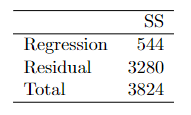

```{r, echo = FALSE, results = "hide"}
include_supplement("vufgb-rsquared-014-nl-table01.jpg", recursive = TRUE)
```

Question
========

See data below. These sums of squares (*Sum of Squares (SS)*) are based on a single regression of dementia scores on age. The sample consists of 50 individuals.


 
Calculate the value of $r^{2}$. 
Answerlist
----------
* 0.14
* 0.17
* 0.83
* 0.86

Solution
========

Answerlist
----------
* Correct
* Incorrect
* Incorrect
* Incorrect

Meta-information
================
exname: vufgb-rsquared-014-en
extype: schoice
exsolution: 1000
exsection: Inferential Statistics/Regression/R squared, Descriptive statistics/Data representation/Tables
exextra[ID]: 3cebd
exextra[Type]: Calculation, Interpreting output
exextra[Program]: 
exextra[Language]: English
exextra[Level]: Statistical Thinking
