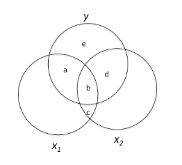

```{r, echo = FALSE, results = "hide"}
include_supplement("vufgb-rsquared-015-nl-venndiagram01.jpg", recursive = TRUE)
```

Question
========

Given is the Venn diagram below in which the relationships between y, $x_{1}$ and $x_{2}$ are displayed.

Complete: $frac{(b+d)}{(a+b+d+e)}$ is the proportion explained variance of y by ...,where ...  ... is held constant.


 
Answerlist
----------
* $x_{1}$; $x_{2}$; well
* $x_{1}$; $x_{2}$; not
* $x_{2}$; $x_{1}$; well
* $x_{2}$; $x_{1}$; not


Solution
========

Answerlist
----------
* Incorrect
* Incorrect
* Incorrect
* Correct

Meta-information
================
exname: vufgb-rsquared-015-en
extype: schoice
exsolution: 0001
exsection: Inferential Statistics/Regression/R squared, Inferential Statistics/Parametric Techniques/Correlations/Pearson, Descriptive statistics/Data representation/Graphs/Venn diagram
exextra[ID]: 1429a
exextra[Type]: Conceptual, Interpreting graph
exextra[Program]: 
exextra[Language]: English
exextra[Level]: Statistical Literacy
