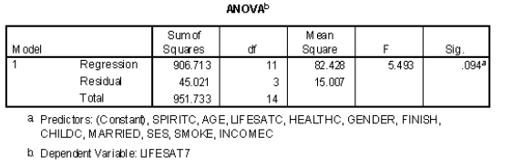

```{r, echo = FALSE, results = "hide"}
include_supplement("vufgb-rsquared-019-nl-table01.jpg", recursive = TRUE)
```

Question
========

Using the ANOVA table below, calculate the proportion of variance explained $R^{2}$ of the dependent variable LIFESAT7 ("Life Satisfaction").


  
Answerlist
----------
* 0.05
* 0.13
* 0.18
* 0.95

Solution
========

Answerlist
----------
* Incorrect
* Incorrect
* Incorrect
* Correct

Meta-information
================
exname: vufgb-rsquared-019-en
extype: schoice
exsolution: 0001
exsection: Inferential Statistics/Regression/R squared, Inferential Statistics/Parametric Techniques/ANOVA
exextra[ID]: bd83d
exextra[Type]: Calculation, Interpreting output
exextra[Program]: 
exextra[Language]: English
exextra[Level]: Statistical Literacy
