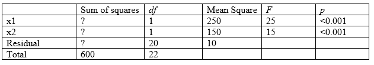

```{r, echo = FALSE, results = "hide"}
include_supplement("vufgb-rsquared-020-nl-table01.jpg", recursive = TRUE)
```

Question
========

A multiple regression analysis is performed in SPSS. Below is the incomplete ANOVA table.

Calculate the *R*-squared ($R^{2}$) of the model.


  
Answerlist
----------
* 0.33
* 0.50
* 0.60
* 0.67

Solution
========

The formula for the $R^{2}$ is $$frac{(TSS-SSE)}{TSS}$. The $TSS = 600$. The $SSE = MSE ˜times df = 10 ˜times 20 = 200$.

The $R^{2}$ is then $\frac{(600-200)}{600} = \frac{400}{600} = 0.67$. Note that the 400 in the numerator corresponds to the Regression Sum of Squares, which can also be captioned by $250 \times 1+150 \times 1$ calculate.

Answerlist
----------
* Incorrect
* Incorrect
* Incorrect
* Correct

Meta-information
================
exname: vufgb-rsquared-020-en
extype: schoice
exsolution: 0001
exsection: Inferential Statistics/Regression/R squared, Inferential Statistics/Regression/Multiple linear regression, Inferential Statistics/Parametric Techniques/ANOVA, Inferential Statistics/Regression/Sum of squares
exextra[ID]: 03849
exextra[Type]: Calculation, Interpreting output
exextra[Program]: SPSS
exextra[Language]: English
exextra[Level]: Statistical Thinking
