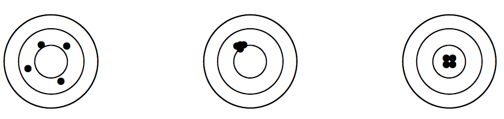

```{r, echo = FALSE, results = "hide"}
include_supplement("vufgb-samplingdistributions-029-nl-figure01.jpg", recursive = TRUE)
```

Question
========

An estimator is a sampling function on the basis of which a population parameter is estimated. Which statement about the quality of the estimator **as depicted in the left figure** is TRUE?


  
Answerlist
----------
* The estimator is pure ('unbiased') and efficient ('efficient').
* The estimator is impure ('biased') and effective ('efficient').
* The estimator is pure ('unbiased') and ineffective ('inefficient').
* The estimator is impure ('biased') and inefficient ('inefficient').


Solution
========

Answerlist
----------
* Incorrect
* Incorrect
* Correct
* Incorrect

Meta-information
================
exname: vufgb-samplingdistributions-029-en
extype: schoice
exsolution: 0010
exsection: Inferential Statistics/Sampling Distributions
exextra[Type]: Interpreting graph, Conceptual
exextra[Program]: 
exextra[Language]: English
exextra[Level]: Statistical Thinking
