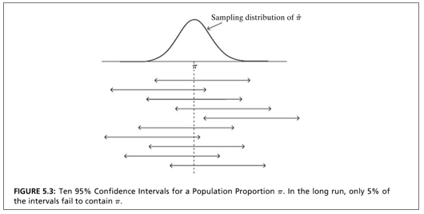

```{r, echo = FALSE, results = "hide"}
include_supplement("vufgb-samplingdistributions-033-nl-graph01.jpg", recursive = TRUE)
```

Question
========

Look at the figure below from Agresti & Finlay's book, and read the caption. What is meant by "In the long run"?

Complete: If the confidence interval...


  
Answerlist
----------
* ... would be calculated in many different samples.
* ... would be calculated in an infinitely large sample.
* ... would be calculated in many different ways.
* ... would be calculated in many different populations.


Solution
========

Answerlist
----------
* Correct
* Incorrect
* Incorrect
* Incorrect

Meta-information
================
exname: vufgb-samplingdistributions-033-en
extype: schoice
exsolution: 1000
exsection: Inferential Statistics/Sampling Distributions
exextra[ID]: 923ad
exextra[Type]: Interpreting graph, Conceptual
exextra[Program]: 
exextra[Language]: English
exextra[Level]: Statistical Literacy
