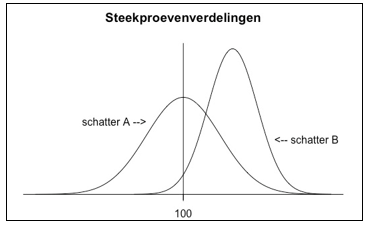

```{r, echo = FALSE, results = "hide"}
include_supplement("vufgb-samplingdistributions-034-nl-graph01.jpg", recursive = TRUE)
```

Question
========

Suppose two different estimators are used to estimate a population parameter (with value 100). The figure below shows the sampling distributions of the two estimators.

Complete. Compared to estimator B, estimator A is...


  
Answerlist
----------
* ...impure (biased) and ineffective (inefficient)
* ...pure (unbiased) but not effective (inefficient)
* ...impure (biased) but effective (efficient)
* ...pure (unbiased) and effective (efficient)


Solution
========

Answerlist
----------
* Incorrect
* Correct
* Incorrect
* Incorrect

Meta-information
================
exname: vufgb-samplingdistributions-034-en
extype: schoice
exsolution: 0100
exsection: Inferential Statistics/Sampling Distributions
exextra[ID]: 261fb
exextra[Type]: Interpreting graph
exextra[Program]: 
exextra[Language]: English
exextra[Level]: Statistical Literacy
