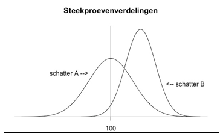

```{r, echo = FALSE, results = "hide"}
include_supplement("vufgb-samplingdistributions-034-nl-graph01.jpg", recursive = TRUE)
```

Question
========

Stel dat er twee verschillende schatters worden gebruikt om een populatieparameter (met waarde 100) te schatten. In onderstaande figuur zie je de steekproevenverdelingen van de twee schatters weergegeven. 

Vul aan. Vergeleken met schatter B is schatter A...


  
Answerlist
----------
* ...onzuiver (biased) en niet doeltreffend (inefficient)
* ...zuiver (unbiased) maar niet doeltreffend (inefficient)
* ...onzuiver (biased) maar doeltreffend (efficient)
* ...zuiver (unbiased) en doeltreffend (efficient)


Solution
========

Answerlist
----------
* Incorrect
* Correct
* Incorrect
* Incorrect

Meta-information
================
exname: vufgb-samplingdistributions-034-nl
extype: schoice
exsolution: 0100
exsection: Inferential Statistics/Sampling Distributions
exextra[Type]: Interpreting graph
exextra[Program]: 
exextra[Language]: Dutch
exextra[Level]: Statistical Literacy