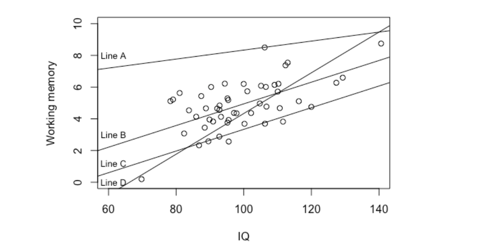

```{r, echo = FALSE, results = "hide"}
include_supplement("vufgb-simplelinearregression-002-en-graph-01.png", recursive = TRUE)
```
Question
========
  
Below you see a scatterplot that displays the association between IQ and Working memory. Which of the four lines in the figure is the regression line fitted with the Least Squares Method?



Answerlist
----------
* Line A. 
* Line B. 
* Line C. 
* Line D. 

Solution
========

Answerlist
----------
* Incorrect 
* Correct 
* Incorrect 
* Incorrect

Meta-information
================
exname: vufgb-simplelinearregression-002-en
extype: schoice
exsolution: 0100
exsection: Inferential Statistics/Regression/Simple linear regression
exextra[Type]: Interpreting graph
exextra[Language]: English
exextra[Level]: Statistical Reasoning
