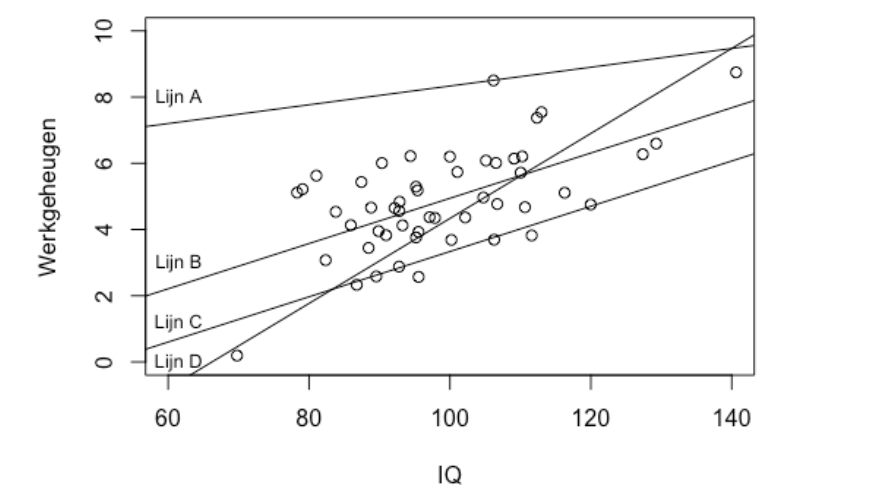

```{r, echo = FALSE, results = "hide"}
include_supplement("vufgb-simplelinearregression-002-nl-graph-01.png", recursive = TRUE)
```
Question
========
  
Gegeven is onderstaande puntenwolk die het verband tussen IQ en Werkgeheugen weergeeft. Welke van de vier lijnen in de figuur is de met behulp van de Kleinste Kwadraten Methode gepaste regressielijn?



Answerlist
----------
* Lijn A. 
* Lijn B. 
* Lijn C. 
* Lijn D. 

Solution
========

Answerlist
----------
* Incorrect 
* Correct 
* Incorrect 
* Incorrect

Meta-information
================
exname: vufgb-simplelinearregression-002-nl
extype: schoice
exsolution: 0100
exsection: Inferential Statistics/Regression/Simple linear regression
exextra[Type]: Interpretating graph
exextra[Language]: Dutch
exextra[Level]: Statistical Reasoning