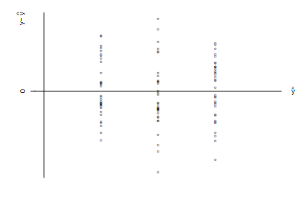

```{r, echo = FALSE, results = "hide"}
include_supplement("vufgb-simplelinearregression-004-nl-graph01.jpg", recursive = TRUE)
```

Question
========
From a linear model, the assumption of homoscedasticity is verified by the following picture.  



What type of linear model does this picture belong to?

Answerlist
----------
* Anova
* Ancova
* Linear regression
* Linear regression with quadratic effect

Solution
========

Answerlist
----------
* Incorrect
* Incorrect
* Correct
* Incorrect

Meta-information
================
exname: vufgb-simplelinearregression-004-en
extype: schoice
exsolution: 0010
exsection: Inferential Statistics/Regression/Simple linear regression, Descriptive statistics/Data representation/Graphs
exextra[ID]: 4b09b
exextra[Type]: Conceptual, Interpreting graph
exextra[Program]: 
exextra[Language]: English
exextra[Level]: Statistical Literacy
