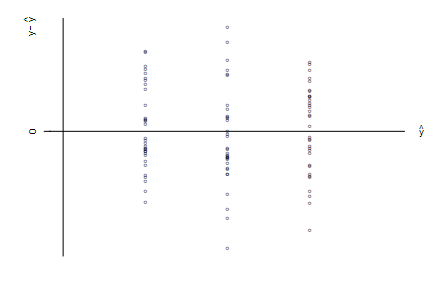

```{r, echo = FALSE, results = "hide"}
include_supplement("vufgb-simplelinearregression-004-nl-graph01.jpg", recursive = TRUE)
```

Question
========
Van een lineair model wordt de aanname van homoscedasticiteit gecontroleerd middels het volgende plaatje.  



Bij welk type lineair model hoort dit plaatje?

Answerlist
----------
* Anova
* Ancova
* Lineaire regressie
* Lineaire regressie met kwadratisch effect

Solution
========

Answerlist
----------
* Incorrect
* Incorrect
* Correct
* Incorrect

Meta-information
================
exname: vufgb-simplelinearregression-004-nl
extype: schoice
exsolution: 0010
exsection: Inferential Statistics/Regression/Simple linear regression, Descriptive statistics/Data representation/Graphs
exextra[ID]: 13bf4
exextra[Type]: Conceptual, Interpreting graph
exextra[Program]: 
exextra[Language]: Dutch
exextra[Level]: Statistical Literacy
