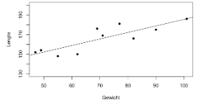

```{r, echo = FALSE, results = "hide"}
include_supplement("vufgb-slope-004-nl-figure01.jpg", recursive = TRUE)
```

Question
========

The figure below shows the relationship between Height (*y*) and Weight (*x*) in a sample of adult women.

Determine the approximate size of the regression coefficient.


  
Answerlist
----------
* 20
* 35
* 3.5
* 0.7

Solution
========

Answerlist
----------
* Incorrect
* Incorrect
* Incorrect
* Correct

Meta-information
================
exname: vufgb-slope-004-en
extype: schoice
exsolution: 0001
exsection: Inferential Statistics/Regression/Slope, Inferential Statistics/Regression
exextra[ID]: 0a82e
exextra[Type]: Interpreting graph, Calculation
exextra[Program]: 
exextra[Language]: English
exextra[Level]: Statistical Literacy
