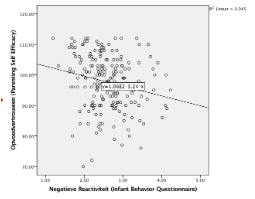

```{r, echo = FALSE, results = "hide"}
include_supplement("vufgb-slope-005-nl-figure01.jpg", recursive = TRUE)
```

Question
========

The figure below shows the point cloud and the best-fit regression line representing the linear relationship between child negative reactivity (*x*) and mother's parenting confidence (*y*). Suppose an additional data point were to be added, with score 5 on *x* and score 110 on *y*.

What would then happen to the regression line?


  
Answerlist
----------
* The regression line would become steeper negative.
* The regression line would become less steep but remain negative.
* The regression line would become positive.
* The regression line would remain unchanged.

Solution
========

Answerlist
----------
* Incorrect
* Correct
* Incorrect
* Incorrect

Meta-information
================
exname: vufgb-slope-005-en
extype: schoice
exsolution: 0100
exsection: Inferential Statistics/Regression/Slope, Inferential Statistics/Regression/Equation
exextra[ID]: 7b533
exextra[Type]: Interpreting graph, Conceptual
exextra[Program]: 
exextra[Language]: English
exextra[Level]: Statistical Thinking
