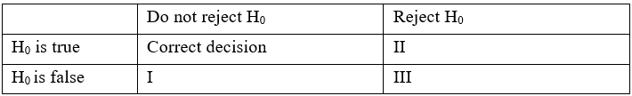

```{r, echo = FALSE, results = "hide"}
include_supplement("vufgb-statisticalerrors-001-en.png", recursive = TRUE)
```

Question
========
In the table below, fill in the appropriate terms for i, ii and iii:



Answerlist
----------
* i: Type-I error, ii: Type-II error,	iii: Power.
* i: Type-II error, ii: Type-I error, iii: Power. 
* i: Type-II error, ii: Power, iii: Type-I error.
* i: Type-I error, ii: Power, iii: Type-II error.

Meta-information
================
exname: vufgb-statisticalerrors-001-en
extype: schoice
exsolution: 0100
exsection: Inferential Statistics/NHST/Statistical errors, Inferential Statistics/NHST/Statistical errors/Type I error, Inferential Statistics/NHST/Statistical errors/Type II error, Inferential Statistics/NHST/Power
exextra[Type]: Conceptual
exextra[Language]: English
exextra[Level]: Statistical Literacy
